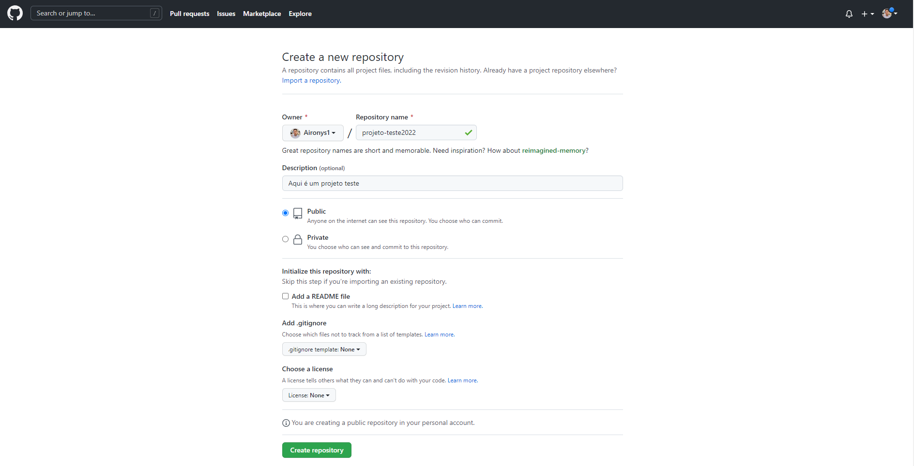
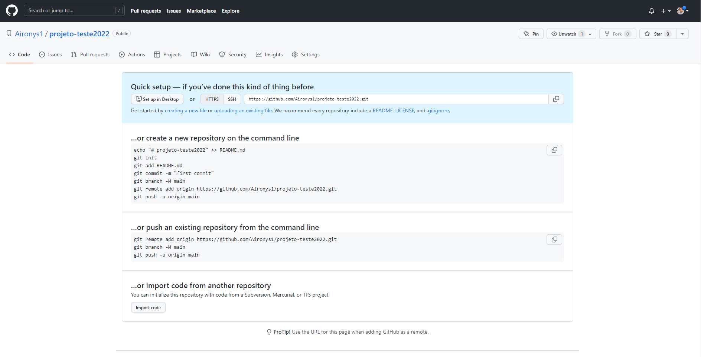

<h1>Criando um repositório no Github</h1>

    
Primeiro temos que criar um repositório no Github

    <a href="https://github.com/" target="_blank">Link  do Github</a>

    
Vamos criar uma conta no Github

    
Imagem abaixo de como criar um repositório no Github

    
    
Criando um repositório no Github

    
Depois de criado, vai gerar uma lista de comandos, para que possamos enviar da sua máquina para o Github

    

